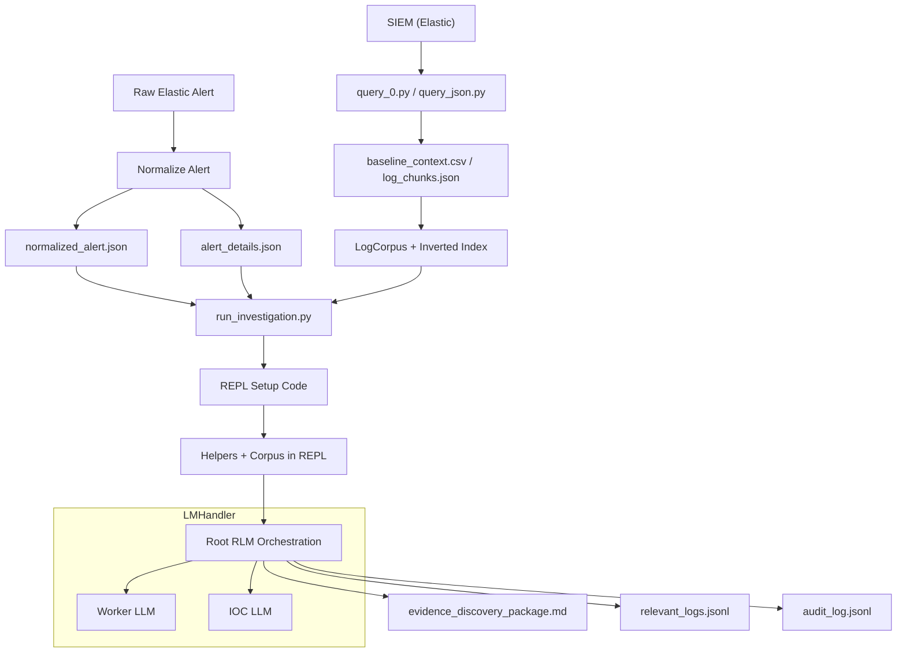
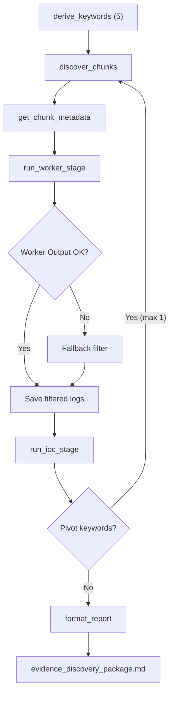

# RLM Investigation Agent

RLM Investigation Agent is a security-evidence harvesting pipeline built on Recursive Language Models (RLM). It ingests a normalized alert, searches a local log corpus for related evidence, and produces a structured report with IOCs and log references. The system is designed for evidence collection only and does not label alerts as benign or malicious.

## Why This Exists
Security triage requires fast, audit-friendly evidence gathering. This project automates:
- Normalizing alert context into a consistent schema
- Locating relevant log chunks without exposing raw logs to the root model
- Delegating log filtering and IOC extraction to sub-LLMs with strict instructions
- Emitting a deterministic, templated report plus a relevant-log bundle

## Pipeline Workflow (Data Flow)


## Investigation Workflow (RLM Orchestration)


## Architecture Details
**1) Alert Intake and Normalization**
- `Intake_Alert/Intake_Elastic_logs.py` pulls the latest Elastic alert.
- `Intake_Alert/Normalize.py` writes:
  - `normalized_alert.json`
  - `alert_details.json`
- The normalized alert includes `message`, file path, host, user, and event code fields so command text and script blocks are available for keyword derivation.

**2) Log Ingestion from SIEM**
- `get_siem_context/query_0.py` (or `query_json.py`) pulls logs from Elastic and normalizes them into a high-fidelity schema.
- Output is stored as `baseline_context.csv` and/or `log_chunks.json`.
- These files are considered sensitive and are ignored by default in `.gitignore`.

**3) Log Corpus**
- `rlm_siem/log_corpus.py` loads `get_siem_context/log_chunks.json`.
- It builds an inverted index of tokens for fast keyword and regex searches.
- The root model sees only chunk IDs and metadata, not raw logs.

**4) REPL Environment + RLM Orchestration**
- `rlm_siem/run_investigation.py` runs the pipeline.
- A REPL environment is created with helper functions:
  - `derive_keywords`
  - `discover_chunks`
  - `get_chunk_metadata`
  - `run_worker_stage`
  - `run_ioc_stage`
  - `format_report`
- The worker LLM writes log-filtering code, which is executed in a sandboxed scope.
- The IOC LLM extracts indicators with `chunk_id:log_index` references.

**5) Report and Evidence Output**
- `evidence_discovery_package.md` is formatted using a fixed template.
- `relevant_logs.jsonl` stores evidence logs for analyst review.
- `audit_log.jsonl` provides an audit trail of pipeline stages.

## Fast Mode (Default)
The pipeline runs in deterministic fast mode to avoid long recursive loops.
- It directly executes the helper stages once.
- It performs at most one pivot.
- It always emits a templated report.

Disable fast mode if you want the full recursive loop:
```
python rlm_siem/run_investigation.py --no-fast
```

## Constraints (By Design)
- Exactly 5 initial keywords.
- At most 3 pivot keywords.
- At most 1 pivot cycle.
- No benign/malicious classification.
- Root model never sees raw logs.

## Setup
1) Create a virtual environment and install deps.
2) Copy `.env.example` to `.env` and fill values.
3) Ensure your log corpus exists at `get_siem_context/log_chunks.json`.

Example:
```
copy .env.example .env
```

## Running the Pipeline
```
python Intake_Alert/Normalize.py
python rlm_siem/run_investigation.py
```

## Configuration
Key environment variables:
- `OPENAI_API_KEY`
- `ELASTIC_HOST`
- `ELASTIC_API_KEY`
- `ELASTIC_COMPAT_VERSION`
- `RLM_MODEL`
- `RLM_MAX_CHUNKS_PER_KEYWORD`
- `RLM_MAX_TOTAL_CHUNKS`
- `RLM_MAX_TOTAL_LOGS`
- `RLM_MAX_LOGS_PER_CHUNK`
- `RLM_IOC_MAX_LOGS`
- `RLM_IOC_MAX_CHARS`

## Outputs (Generated)
These are ignored by default in `.gitignore` because they can contain sensitive data:
- `get_siem_context/evidence_discovery_package.md`
- `get_siem_context/relevant_logs.jsonl`
- `get_siem_context/audit_log.jsonl`
- `get_siem_context/rlm_logs/*.jsonl`

## Docs
- `Docs/engineering_report.md`
- `Docs/prompts.md`
- `Docs/diagram.md`

## Troubleshooting
Common issues:
- Missing `message` in alerts: rerun `Intake_Alert/Normalize.py`.
- Worker exec errors: check `audit_log.jsonl` for `worker_exec_error`.
- Slow runs: lower `RLM_MAX_TOTAL_LOGS` and `RLM_IOC_MAX_LOGS`.
- Git push too large: remove artifacts and rewrite history (see engineering report).

## Disclaimer
This system is for evidence harvesting only. It does not decide whether an alert is benign or malicious.
