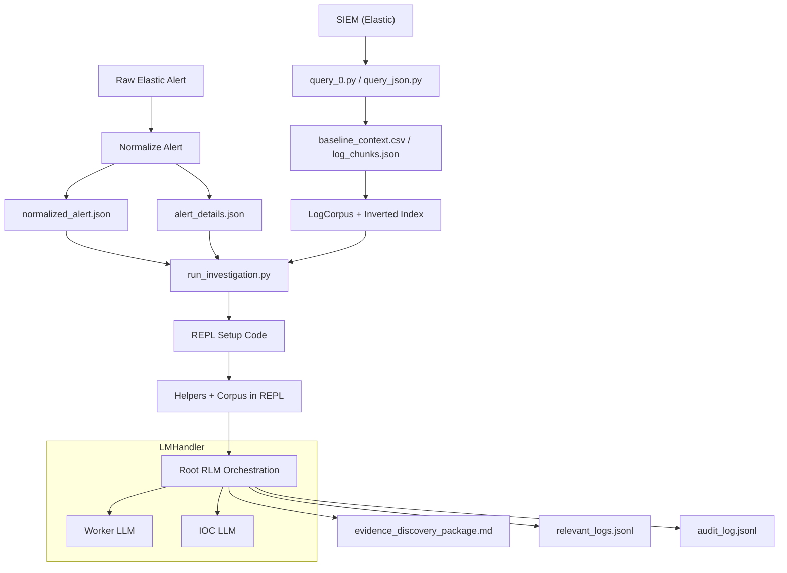
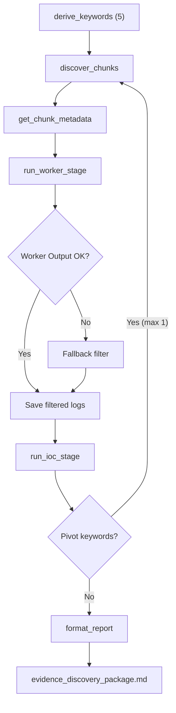

# RLM-SIEM Diagram

```mermaid
flowchart TD
    A["SIEM (Elastic)"] --> B["query_0.py / query_json.py"]
    B --> C["baseline_context.csv / log_chunks.json"]
    C --> D["LogCorpus + Inverted Index"]

    E["Raw Elastic Alert"] --> F["Normalize Alert"]
    F --> G["normalized_alert.json"]
    F --> H["alert_details.json"]

    G --> I["run_investigation.py"]
    H --> I
    D --> I

    I --> J["REPL Setup Code"]
    J --> K["Helpers + Corpus in REPL"]
    K --> L["Root RLM Orchestration"]

    subgraph LMHandler
      L --> M["Worker LLM"]
      L --> N["IOC LLM"]
    end

    L --> O["evidence_discovery_package.md"]
    L --> P["relevant_logs.jsonl"]
    L --> Q["audit_log.jsonl"]
```

```mermaid
flowchart TD
    A["derive_keywords (5)"] --> B["discover_chunks"]
    B --> C["get_chunk_metadata"]
    C --> D["run_worker_stage"]
    D --> E{Worker Output OK?}
    E -- "Yes" --> F["Save filtered logs"]
    E -- "No" --> G["Fallback filter"]
    G --> F

    F --> H["run_ioc_stage"]
    H --> I{Pivot keywords?}
    I -- "Yes (max 1)" --> B
    I -- "No" --> J["format_report"]
    J --> K["evidence_discovery_package.md"]
```
