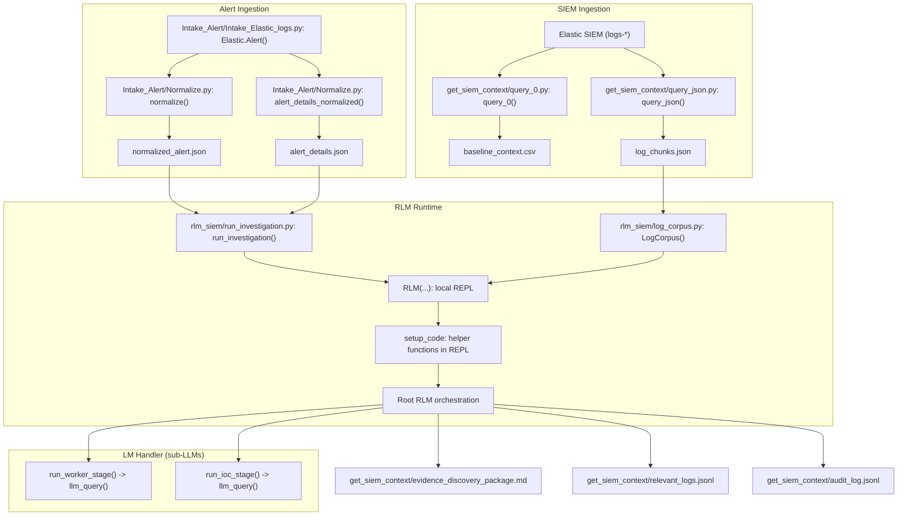
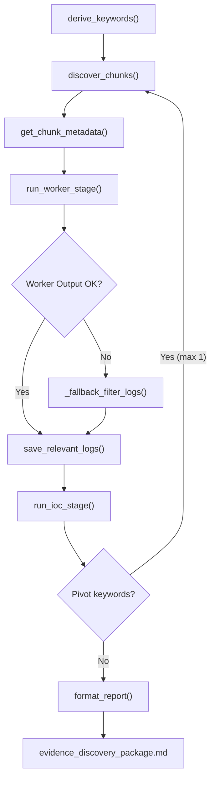

# RLM-SIEM Detailed Diagrams

## Pipeline Workflow (Detailed Data + Control Flow)

## Investigation Workflow (Helper Functions + Control Loop)

## Process Notes (Mapped to Function Names)
- Alert ingestion uses `Elastic.Alert()` to pull the latest alert and `normalize()` to write `normalized_alert.json` plus `alert_details_normalized()` for `alert_details.json`.
- SIEM log pull is handled by `query_0()` or `query_json()` which write `baseline_context.csv` and/or `log_chunks.json`.
- Corpus load is performed by `LogCorpus()` which builds an inverted index for keyword and regex search.
- REPL injection is done by `run_investigation()` which provides helper functions inside the REPL scope (the `setup_code` block).
- Root orchestration uses `derive_keywords()`, `discover_chunks()`, `get_chunk_metadata()` before delegating to sub-LLMs.
- Worker stage calls `run_worker_stage()` which asks a sub-LLM to write filtering code, executes it, and falls back to `_fallback_filter_logs()` if needed.
- IOC stage calls `run_ioc_stage()` to extract indicators and pivot keywords from filtered logs.
- Reporting is performed by `format_report()` to produce `evidence_discovery_package.md` plus `relevant_logs.jsonl` and `audit_log.jsonl`.
