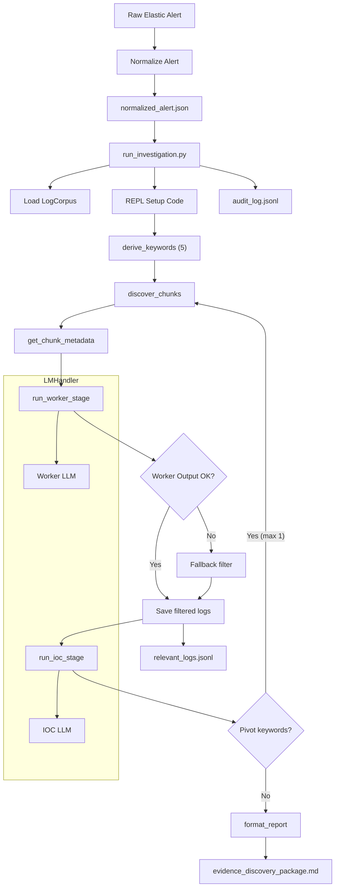

# RLM-SIEM Engineering Report

**Overview**
This document explains the current RLM-SIEM pipeline architecture, the major engineering changes made, and the exact prompts used by the system. It also embeds the Mermaid flowchart and links to the standalone diagram.

**High-Level Architecture**
- Alert intake pulls the most recent Elastic alert and writes `raw_alert.json`.
- Normalization writes `normalized_alert.json` and `alert_details.json` with consistent fields, including `message` and file path data.
- Log corpus loads `log_chunks.json` and exposes helper functions for keyword search and chunk access.
- The fast pipeline runs deterministic steps in a REPL to avoid long recursive loops.
- Sub-LLM calls are made only through helper functions (worker and IOC stages).
- Evidence artifacts are written to disk and summarized in a report template.

**Mermaid Flowchart**

**Engineering Changes Implemented**
- Added `message` to normalized alert to preserve raw script/command text.
- Keyword derivation now prioritizes file path fragments and command content before generic tokens.
- Worker execution is sandboxed with a clean exec globals dict to avoid REPL corruption.
- Builtins are snapshotted and restored after worker execution.
- Fallback filtering runs if worker output is malformed or empty.
- Fast mode bypasses the root RLM loop for deterministic execution and speed.
- Tight runtime caps reduce log volume and improve responsiveness.
- Audit logging records all stages for transparency.

**Artifacts and Outputs**
- `get_siem_context/evidence_discovery_package.md` contains the final evidence report.
- `get_siem_context/relevant_logs.jsonl` contains filtered log records.
- `get_siem_context/audit_log.jsonl` records the audit trail.
- `get_siem_context/rlm_logs/*.jsonl` records RLM iterations.

**Prompts**
Prompts are documented in `Docs/prompts.md`.

**Diagram**
The Mermaid diagram is also available in `Docs/diagram.md`.
